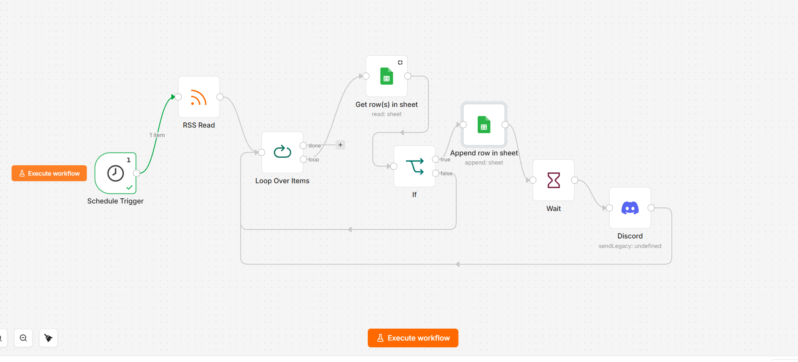
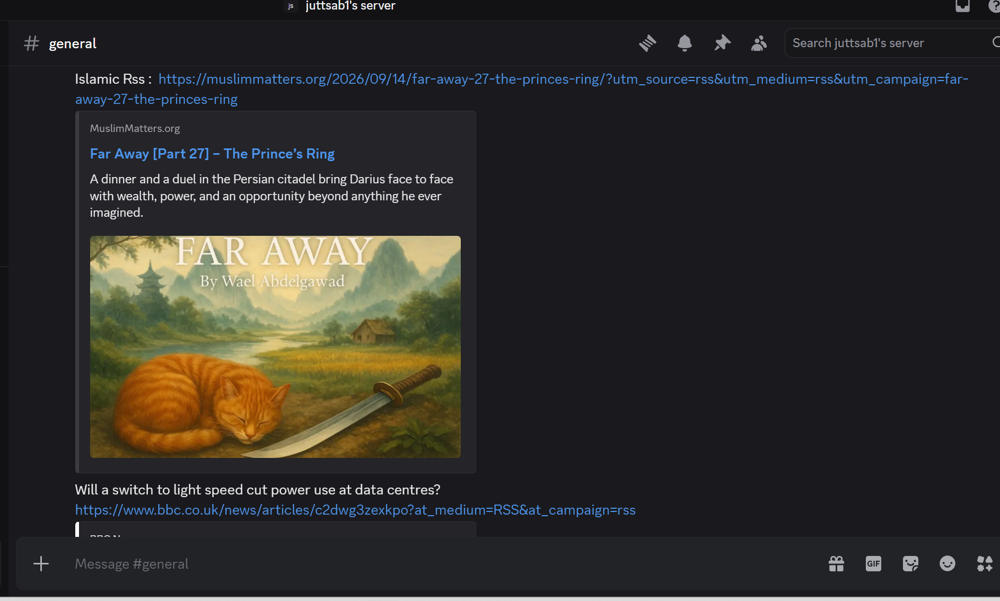

# Auto Content Poster (n8n Automation)

This repository contains an automated content posting workflow built with **n8n**. The workflow fetches new articles from an RSS feed, checks them against a Google Sheets database to prevent duplicate posting, and sends the unique articles to a Discord channel via webhooks.

## 🚀 Features
* **Automated RSS Fetching:** Runs daily at 8:00 AM to fetch new Islamic articles from the Muslim Matters RSS feed.
* **Duplicate Content Filtering:** Uses Google Sheets as a database to store previously posted article links. The `IF` node ensures only fresh content is processed.
* **Rate Limit Handling:** Integrates a `Wait` node before Discord execution to prevent API spamming and webhook blocking.
* **Discord Integration:** Automatically formats and delivers the new article links to a Discord server.

## 📂 Repository Files
* `auto_content_poster_workflow.json` - The complete n8n workflow code.
* `workflow_architecture.png` - Visual representation of the n8n nodes and logic.
* `discord_output_result.png` - Proof of successful automated posting in Discord.

## 🛠️ How to Use This Workflow
1. Download the `auto_content_poster_workflow.json` file.
2. Open your n8n instance and click on **Import from File** in a new workflow canvas.
3. **Update Credentials:**
   * Re-link your Google Service Account in both Google Sheets nodes.
   * Add your own Google Sheet ID.
   * Add your Discord Webhook URL in the Discord node.
4. Activate the workflow.

## 📸 Project Screenshots

### Workflow Architecture

### Live Output in Discord

